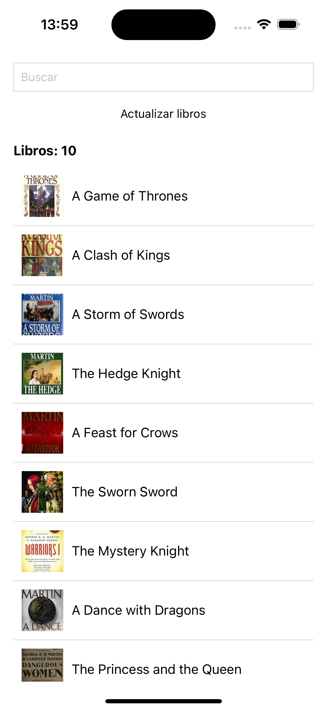
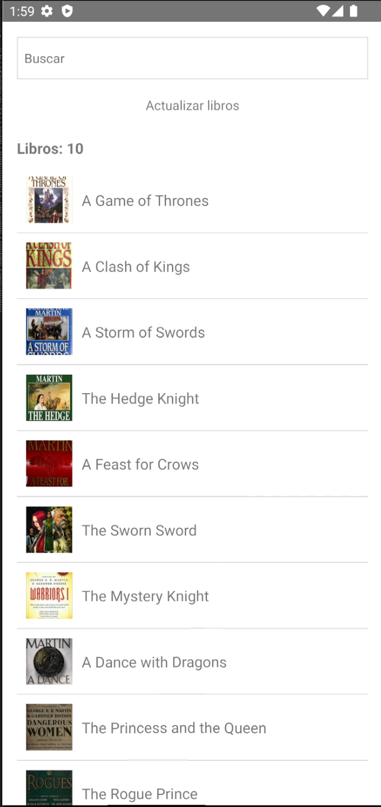

# Prueba Técnica para OpositaTest

¡Bienvenido/a a la prueba técnica de OpositaTest!

## Objetivo

El objetivo de esta prueba es evaluar tus habilidades en React Native y tu capacidad para optimizar y mejorar código existente. Se espera que proporciones sugerencias para mejorar el rendimiento, la estructura y la mantenibilidad del código. Además, es crucial que la aplicación sea compatible con versiones de Android 6 (Marshmallow) o superiores y versiones de iOS. El código proporcionado implementa una aplicación básica de visualización de libros, y tendrás que identificar áreas de mejora y aplicar tus conocimientos para optimizarlo.

## Instrucciones

1. **Revisión del Código:**

   - Analiza el código proporcionado.
   - Identifica áreas que podrían mejorarse, ya sea en términos de rendimiento, estructura del código o buenas prácticas de desarrollo.

2. **Mejoras Sugeridas:**

   - Propón mejoras específicas para optimizar el rendimiento, la legibilidad y la mantenibilidad del código.
   - Implementa estas mejoras.
   - Asegúrate de que la aplicación funcione correctamente en las diferentes plataformas.
   - Se valorara positivamente el uso de alguna micro-animación.
   - El uso de tests.
   - Se valorarán las buenas prácticas en los commits (atómicos, explicados, etc..)

3. **Compatibilidad con Android e iOS:**

   - Verifica que la aplicación sea compatible con Android e iOS.
   - Ajusta el código según las limitaciones de las versiones mencionadas para garantizar una funcionalidad óptima en ambos sistemas operativos.

4. **Pruebas y Validación:**

   - Verifica que no se hayan introducido errores o problemas de rendimiento en la aplicación.
   - Documenta los pasos para ejecutar las pruebas y validarla.

5. **Nuevas funcionabilidades (opcional)**

- Ordenación Alfabética: Se valorará muy positivamente la implementación de una funcionalidad que permita ordenar los libros alfabéticamente y que esta ordenación persista incluso si se cierra la aplicación.

6. **Entrega:**
   - Sube tus cambios a un repositorio en GitHub.
   - Incluye un archivo `README.md` en el repositorio que explique las mejoras realizadas.
   - Entrega al menos un binario de alguna de las plataformas (Android `.apk/.aab` o iOS `.ipa`).
   - Incluye instrucciones para la instalación y ejecución de la aplicación en el `README.md`.

## App





# HOW I EMBRACE IT

# Notes

Para generar la build en iOS (.ipa), sin tener una cuenta de developer pagada y poder probarla en producción desde un dispositivo físico, debes hacer click en el schema de tu app > Targets (el de "...Test" también) > Signing & Capabilities > Check 'Automatically manage signing' & setear tu cuenta

## Limpiar build anterior (opcional)
xcodebuild clean -workspace YourProjectName.xcworkspace -scheme YourProjectName -configuration Release

## Generar el archivo .xcarchive
xcodebuild archive -workspace YourProjectName.xcworkspace -scheme YourProjectName -configuration Release -sdk iphoneos -archivePath ~/Desktop/YourProjectName.xcarchive

## Generar ExportOptions.plist

```xml
<?xml version="1.0" encoding="UTF-8"?>
<!DOCTYPE plist PUBLIC "-//Apple//DTD PLIST 1.0//EN" "http://www.apple.com/DTDs/PropertyList-1.0.dtd">
<plist version="1.0">
   <dict>
      <key>method</key>
      <string>development</string>
      <key>provisioningProfiles</key>
      <dict>
         <key>org.reactjs.native.example.opositatestprueba</key>
         <string>Unai Canales</string>
      </dict>
   </dict>
</plist>
```

## Exportar el archivo .ipa
xcodebuild -exportArchive -archivePath ~/Desktop/YourProjectName.xcarchive -exportOptionsPlist **/path/to/**ExportOptions.plist -exportPath ~/Desktop/pathExport
